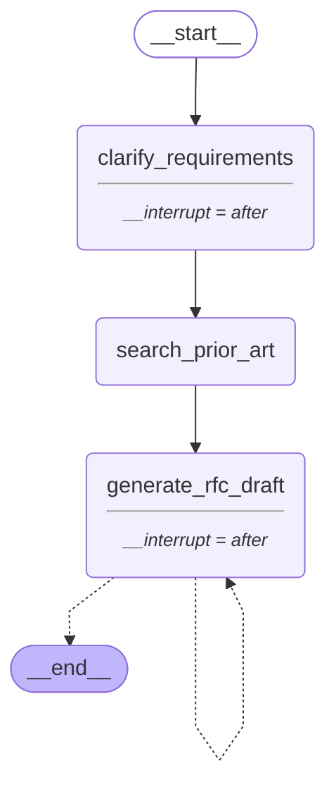

# Engineering RFC Generator

A LangGraph agent that helps engineers write better RFCs faster, by asking the right clarifying questions, searching for prior art, drafting a structured proposal, and learning from past decisions across sessions.

## The Problem

- **Writing RFCs takes too long.** Junior and mid-level engineers can spend days on a first RFC because they do not know what level of detail is expected, what alternatives to consider, or how to frame trade-offs for a senior audience. The blank page problem kills adoption.
- **Quality is wildly inconsistent.** Without guidance, RFCs vary in depth and structure across teams. Some are too thin to be useful, others so long nobody reads them. Review cycles waste time on structural feedback rather than genuine technical debate.
- **Prior art is ignored.** Engineers regularly propose solutions already tried and rejected, simply because past RFCs are buried in Confluence or Notion and nobody searches them. The same decisions get relitigated across teams.
- **Tribal knowledge stays tribal.** When engineers skip RFCs for decisions that warrant them, architectural choices become undocumented. Onboarding new engineers is harder, consistency across teams suffers, and institutional memory walks out the door.

## What This Does

The agent walks an engineer from a rough problem statement to an approved RFC. It asks clarifying questions, searches for relevant prior art and industry patterns, drafts a structured RFC, runs a bounded revision loop with a human approval gate, and stores the outcome in long-term memory so future RFCs benefit from what came before.

## Architecture

**Target architecture** (full, including the Phase 2 memory layer):

```
START -> load_project_memory -> clarify_requirements (human-in-the-loop) -> search_prior_art (Tavily)
      -> retrieve_past_rfcs (LangGraph Store) -> generate_rfc_draft -> revision_loop (max 3 cycles)
      -> human_approval_gate (interrupt) -> update_memory (TrustCall) -> END
```

**Current implementation (Phase 1, no memory layer yet):**




## How Memory Improves Quality

_(Before/after eval scores from Step 13 go here.)_

## LangSmith Trace

_(Trace screenshot from Step 12 goes here.)_

## Setup

1. Clone the repo and create a virtual environment:
   ```bash
   python3 -m venv venv
   source venv/bin/activate
   ```
2. Install dependencies:
   ```bash
   pip install -r requirements.txt
   ```
3. Copy `.env.example` to `.env` and fill in your own keys:
   ```bash
   cp .env.example .env
   ```
4. Run the graph:
   ```bash
   python main.py
   ```

## What Is Next

- Outcome tracking on past RFC decisions
- Postgres-backed store for production use
- Slack integration for approval notifications

---

Mohit Gulati | github.com/MohitGulati32 | linkedin.com/in/mohit-gulati32
