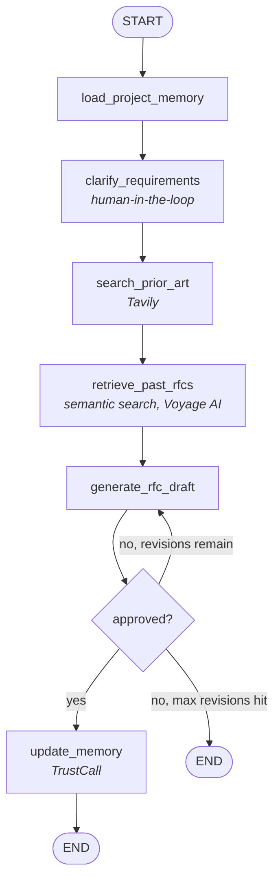
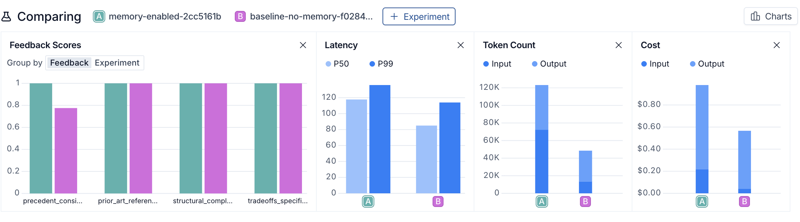
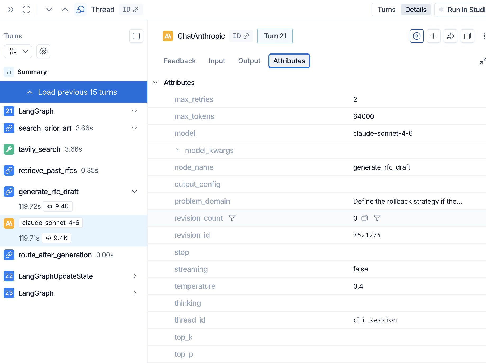

# RFC Copilot

An AI-powered RFC generator that learns your team's engineering decisions over time, built on LangGraph and LangSmith.

Measured result: In a 10-item LangSmith evaluation, long-term memory improved consistency with previous engineering decisions by 29% (3.80 → 4.90/5), while general RFC quality remained unchanged.

## The Problem

- **Writing RFCs takes too long.** Engineers spend days on a first draft because they don't know what level of detail is expected, what alternatives to weigh, or how to frame trade-offs for a senior audience.
- **Quality is inconsistent.** Without guidance, RFCs vary wildly in depth and structure. Review cycles waste time on structural feedback instead of genuine technical debate.
- **Prior art gets ignored, and decisions get relitigated.** Past RFCs are buried in Confluence or Notion. The same architectural debates happen again six months later because nobody remembers, or nobody searched, what was already decided.

## What This Does

RFC Copilot is a LangGraph agent that interviews you about a problem, searches for relevant industry prior art, and drafts a structured RFC, then remembers the outcome. Every approved RFC updates a long-term memory layer: a project profile (tech stack, team size, past decisions) and a searchable history of prior RFCs. The next time you ask for an RFC on a related problem, the agent asks fewer redundant questions and writes a draft that's consistent with what your team has already decided, not just generically well-structured.

## Architecture



- **`load_project_memory`** fetches the project's profile (tech stack, team size, past decisions) from the LangGraph Store and injects it into context.
- **`clarify_requirements`** asks 3-5 targeted questions, skipping anything the profile already answers. This is a human-in-the-loop checkpoint: the graph pauses (`interrupt_after`) until you answer.
- **`search_prior_art`** runs a Tavily search for relevant industry patterns and public writeups.
- **`retrieve_past_rfcs`** does a semantic search (Voyage AI embeddings) over the team's own RFC history for related precedent.
- **`generate_rfc_draft`** writes the full RFC: Problem, Proposed Solution, Alternatives Considered, Trade-offs and Risks, Implementation Plan, Open Questions.
- A revision loop lets you request changes (up to 3 cycles) before a second human-in-the-loop approval gate.
- **`update_memory`** runs only on approval. TrustCall patches the project profile with only what genuinely changed, and a new RFC record is added to memory for future retrieval.

Every LLM and tool call across every node is traced to LangSmith with custom metadata (`node_name`, `revision_count`, `problem_domain`, `model`), not just the default LangGraph node span.

## Does Memory Actually Help? (Measured, Not Assumed)

Rather than assume the memory layer improves output quality, this was measured directly. A 10-item eval dataset was built (problem statements plausibly extending the same team's existing profile and RFC history), then run twice through an identical, non-interactive evaluation graph, once with an empty project profile and no retrieved RFCs, once with the team's real accumulated memory (7 approved RFCs, a populated profile).

Each generated draft was scored by a deterministic structural check and an LLM-as-judge evaluator across four metrics:

| Metric | No Memory | With Memory | Change |
|---|---|---|---|
| `precedent_consistency` | 3.80 / 5 | 4.90 / 5 | **+29%** |
| `structural_completeness` | 1.00 | 1.00 | unchanged |
| `prior_art_referenced` | 1.00 | 1.00 | unchanged |
| `tradeoffs_specificity` | 5.00 / 5 | 5.00 / 5 | unchanged |


The finding is precise rather than sweeping: memory's effect is specifically isolated to `precedent_consistency`, whether the draft stays aligned with the team's own past decisions rather than defaulting to generic best practice. The other three metrics were already at ceiling without memory (Claude writes structurally complete, well-cited, specific drafts regardless), so they didn't and shouldn't move. That's a more honest and more defensible result than an across-the-board score bump would have been.



Trade-off: Memory improved precedent consistency, but increased token usage, latency and cost. This makes memory an architectural trade-off rather than a free quality improvement. Its value depends on how important historical consistency is to the use case.

## Observability

Every node, and every LLM/tool call within it, is traced to LangSmith with custom metadata for filtering by node, revision count, problem domain, and model.



## Setup

```bash
git clone https://github.com/MohitGulati32/rfc-copilot.git
cd rfc-copilot
python3.11 -m venv venv
source venv/bin/activate
pip install -r requirements.txt
cp .env.example .env
# fill in ANTHROPIC_API_KEY, TAVILY_API_KEY, VOYAGE_API_KEY, LANGSMITH_API_KEY
```

## Usage

**Generate an RFC:**

```bash
python main.py
```

Describe the problem, answer the clarifying questions (a single message covers all of them), review the draft, approve or request revisions.

**Run the eval suite:**

```bash
python evals/dataset.py       # creates/syncs the 10-item LangSmith dataset (one-time)
python -m evals.evaluator     # runs the memory-enabled comparison
```

## What's Next

- **Outcome tracking**: `RFCMemory.outcome` is currently always `null`. Wiring this up (did the approved decision actually work out?) would let retrieval eventually favor RFCs with good outcomes, not just topical similarity.
- **Postgres-backed Store**: the current `InMemoryStore` with local JSON persistence is fine for development; production would need a durable, concurrent-safe backing store.
- **Slack integration**: surfacing the clarifying questions and draft review in Slack instead of a CLI, so the human-in-the-loop steps fit into how engineers already work.

---

Mohit Gulati | [github.com/MohitGulati32](https://github.com/MohitGulati32) | [linkedin.com/in/mohit-gulati32](https://linkedin.com/in/mohit-gulati32)
